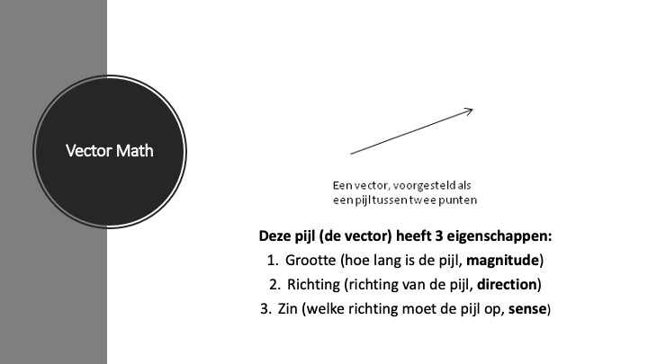
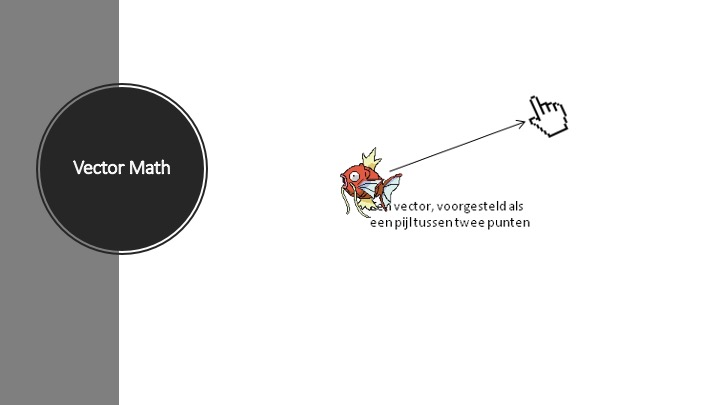
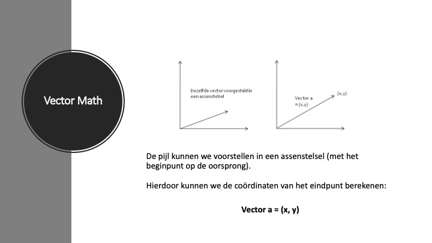
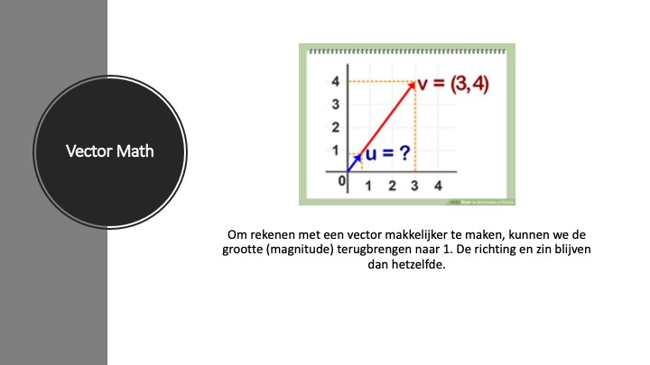
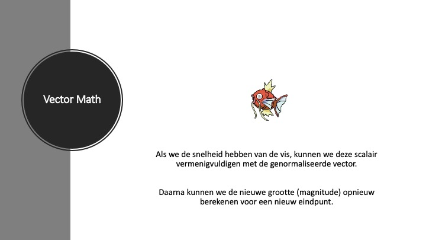

# PRG04-pixi-vectormath
 
Aangezien we in dit project te maken hebben met een legacy dependency, run je geen 'npm install' zoals gewoonlijk, maar:

```
npm install --legacy-peer-deps
```

---

## Lesmateriaal: slides





